
<pre align="center"><strong>Xavier Olive |</strong> <a href="https://www.xoolive.org">Homepage</a> | <a href="https://twitter.com/x00live">Twitter</a> | <a href="https://mapstodon.space/@xoolive">Mastodon</a> | <a href="https://github.com/xoolive">GitHub</a> | <a href="https://www.researchgate.net/profile/Xavier-Olive">ResearchGate</a> | <a href="https://linkedin.com/in/xoolive">LinkedIn</a> | <a href="https://stackoverflow.com/users/1595335/xoolive">Stack Overflow</a> | <a href="https://www.strava.com/athletes/6098259">Strava</a></pre>


     
I am a **research scientist** at ONERA, the French Aerospace Lab, passionate about **aviation, maps and data**.

My research interests include Data Science, Machine Learning and Decision Science applied to aviation, with a particular focus on optimisation, anomaly and pattern detection. Applications range from air traffic management, operations, predictive maintenance, safety analyses and risk assessment.

Although my main job revolves around academic research, writing proposals and [research papers](https://www.xoolive.org/research), I consider decent software engineering, sharing among peers and with the general public, and reproducibility of results key components of my activity.

## Book

I am the author of the Python book (in French) [*Programmation Python avancée*](https://www.xoolive.org/python/) *– Guide pour une pratique élégante et efficace* (ISBN  978-2-10-086329-7), [available](https://amzn.eu/d/g6nXxpe) online (2nd edition)

[](https://www.xoolive.org/python)

I am also one of the main contributors of the (hatching) book [*A journey through aviation data*](https://aviationbook.netlify.app/).

[](https://aviationbook.netlify.app/)

## Software libraries

I am the main developper of the [traffic](https://github.com/xoolive/traffic) library suite designed for analysing air traffic trajectory data.  

[](https://github.com/xoolive/traffic)
[](https://github.com/xoolive/traffic.js)  
[](https://github.com/xoolive/thrust)

and one of the initiators of the [tangram](https://github.com/open-aviation/tangram) platform.

[](https://github.com/open-aviation/tangram)

It heavily relies on more libraries I contribute to:

[](https://github.com/xoolive/cartes)
[](https://github.com/xoolive/jet1090)
[](https://github.com/open-aviation/pitot)
[](https://github.com/open-aviation/pyopensky)
[](https://github.com/xoolive/datalink)
[](https://github.com/achevrot/impunity)

## Community and interests

## Teaching materials

[](https://github.com/xoolive/pyclass)
[](https://github.com/xoolive/optim4ai)
[](https://github.com/xoolive/constraints)

The [facile](https://github.com/xoolive/facile) library is a Python binding to a research-oriented constraint satisfaction and optimisation solver originally written in OCaml. The library offers a comfortable syntax for teaching purposes. I wrote a basic [blog post](https://www.xoolive.org/2014/09/20/python-wrapping-for-ocaml-facile-library.html) few years ago to explain the technical *tour de force* it has been to implement a binding between two such different languages.

[](https://github.com/xoolive/facile)

## Scientific records

Available on my [personal website](https://www.xoolive.org/research)
